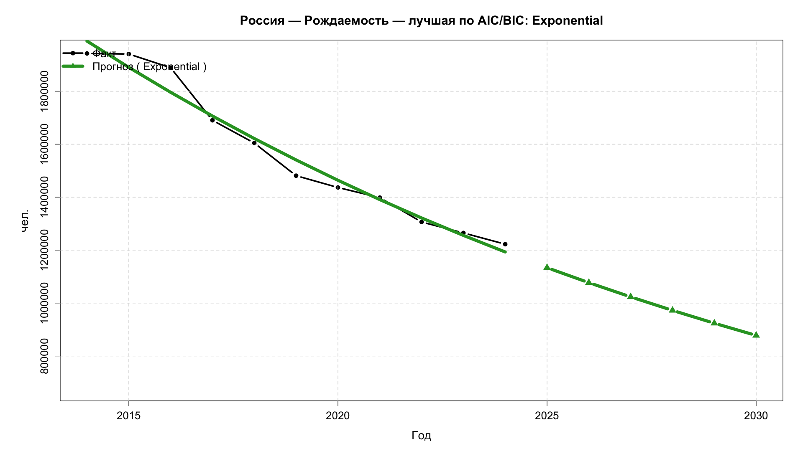
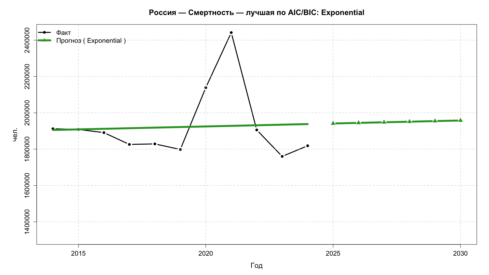
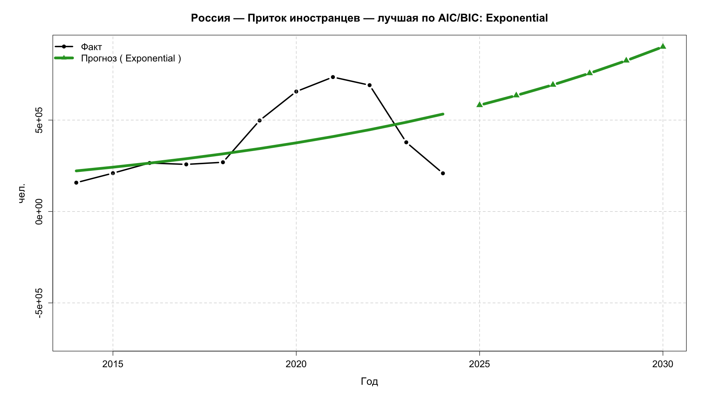
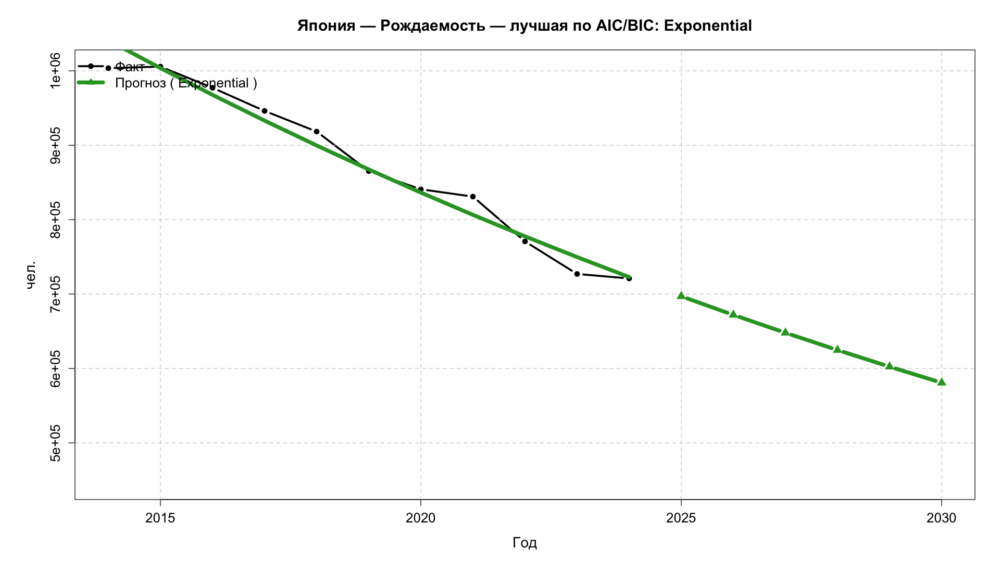
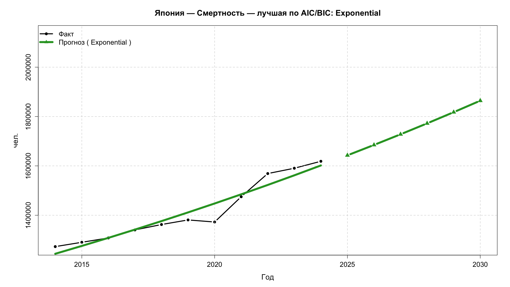
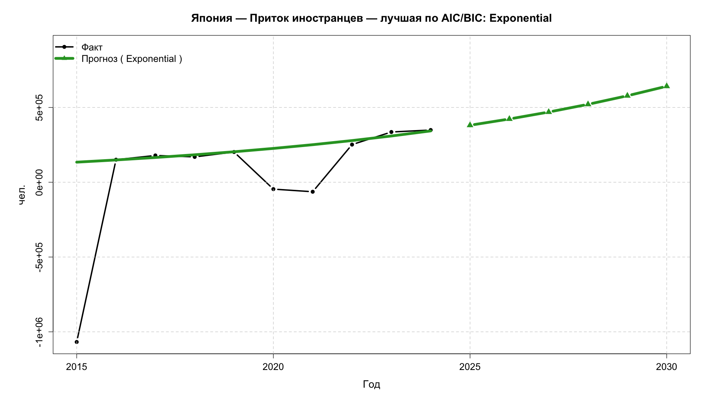

# Сравнительный анализ и прогнозирование тремя моделями регрессии с выбором модели по критериям AIC, BIC,  для проверки гипотезы о ухудшении - улучшении положения демографии, критерием Хи-квадрат 

## Russia 2014-2024

| Год | Общая численность населения | Количество родившихся | Количество умерших | Получено гражданства |
|-----|----------------------------|----------------------|-------------------|---------------------|
| 2014 | 144,025,334 | 1,942,683 | 1,912,347 | 157,800 |
| 2015 | 146,743,989 | 1,940,579 | 1,908,541 | 209,799 |
| 2016 | 147,580,009 | 1,888,729 | 1,891,015 | 265,319 |
| 2017 | 147,182,316 | 1,690,307 | 1,826,125 | 257,800 |
| 2018 | 147,797,071 | 1,604,344 | 1,828,910 | 269,400 |
| 2019 | 147,840,696 | 1,481,074 | 1,798,307 | 497,800 |
| 2020 | 147,959,284 | 1,436,514 | 2,138,586 | 656,300 |
| 2021 | 147,455,745 | 1,398,253 | 2,441,594 | 735,385 |
| 2022 | 146,980,061 | 1,306,200 | 1,905,800 | 691,045 |
| 2023 | 146,447,424 | 1,264,938 | 1,760,200 | 378,500 |
| 2024 | 146,028,325 | 1,222,408 | 1,818,635 | 209,000 |

## Japan 2014-2024

| Год | Общая численность населения | Количество родившихся | Количество умерших | Количество иностранных резидентов |
|-----|----------------------------|----------------------|-------------------|---------------------------------|
| 2014 | 127,237,150 | 1,003,609 | 1,273,025 | 3,300,000 |
| 2015 | 127,094,745 | 1,005,721 | 1,290,510 | 2,232,189 |
| 2016 | 126,932,772 | 977,242 | 1,308,158 | 2,382,822 |
| 2017 | 126,706,210 | 946,146 | 1,340,567 | 2,561,848 |
| 2018 | 126,443,180 | 918,400 | 1,362,470 | 2,731,093 |
| 2019 | 126,166,948 | 865,239 | 1,381,093 | 2,933,137 |
| 2020 | 126,146,099 | 840,832 | 1,372,648 | 2,887,116 |
| 2021 | 125,502,000 | 831,000 | 1,475,000 | 2,823,565 |
| 2022 | 124,947,000 | 770,747 | 1,568,961 | 3,075,213 |
| 2023 | 124,500,000 | 727,000 | 1,590,503 | 3,410,992 |
| 2024 | 123,753,040 | 720,988 | 1,618,684 | 3,760,000 |

## Russia (best model)

## Japan (best model)

